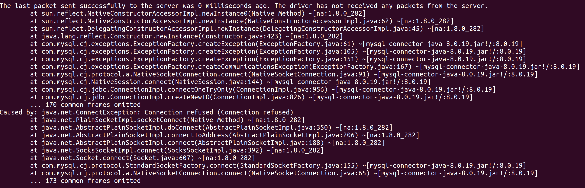

<h1>Docker</h1>

1. Your [Dockerfile](Dockerfile).

2. Your running docker instance as shown by a ps command.

3. Your browser accessing the main page of the website from your local container.

<h1>Docker compose - MySQL only</h1>

1. The output from the [docker-compose up](docker_compose_out.txt) command.

2. Your browser accessing the “Veterinarians” page of the website from your local con-
tainer when you run the application from the host system.

3. A section of the [stack trace](mysql_failure.txt) generated when you attempt to run the application
container that has been updated to use MySQL.

<h1>Docker compose - App server and MySQL</h1>

1. Your updated [docker-compose.yml](docker-compose.yml) file containing the application server, built from
your local Dockerfile, and the existing MySQL configuration

2. Your updated [application-mysql.properties](src/main/resources/application-mysql.properties) file containing the URL change for
the database server.

3. The [output from the docker-compose up](docker_compose_success.txt) command.

4. Your browser accessing the “Veterinarians” page of the website from your local container.

